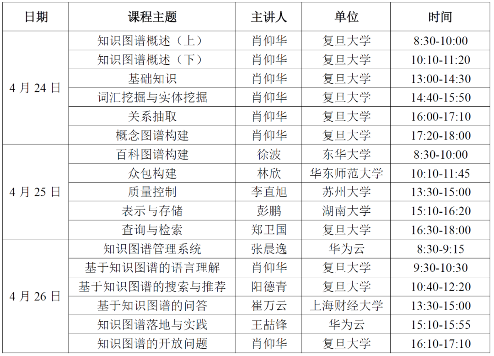

知识图谱系统学习
===
# 概要
    本次课程体系由复旦大学肖仰华教授策划，讲者为复旦大学、华为云、湖南大学、华东师范大学、上海财经大学、东华大学、苏州大学等青年学者。课程在国内多次巡回演讲，受到参会人员一致好评。  
    知识图谱课程全面系统讲授、研讨知识图谱相关概念与技术主题，对当前行业落地过程的一系列困难进行答疑解惑，使学员系统地掌握知识图谱概念与技术。同时，本次课程还邀请了两位华为云的专家，结合华为云知识计算即服务（KaaS）解决方案，为学员深度解析知识图谱行业实践经验。

# 课程安排

# 注意
本文主要是为了虚学习交流，任何人将本文内容用作商用或者其他用途造成侵权，本文概不负责，请各位在合法的范围内进行学习交流。

# DAY 1 
今天的课程视频链接如下:
链接：https://pan.baidu.com/s/1M--rMJRVrxHjdDttRTzFXA 
提取码：fnhs 
复制这段内容后打开百度网盘手机App，操作更方便哦

**如果链接失效，请留下邮箱，我会发给你们的**
